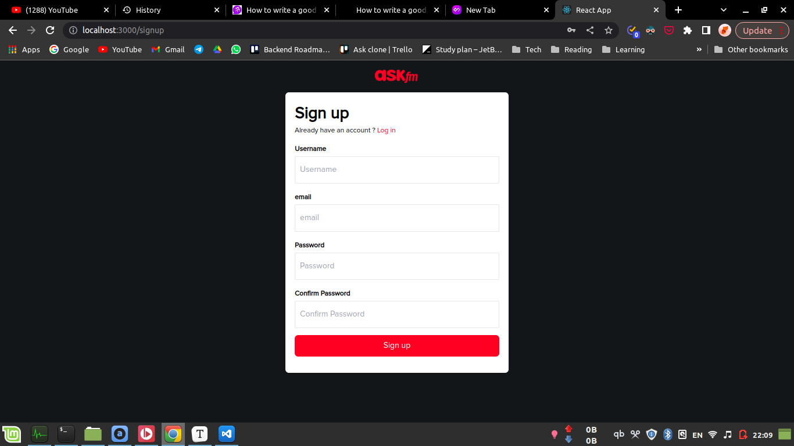
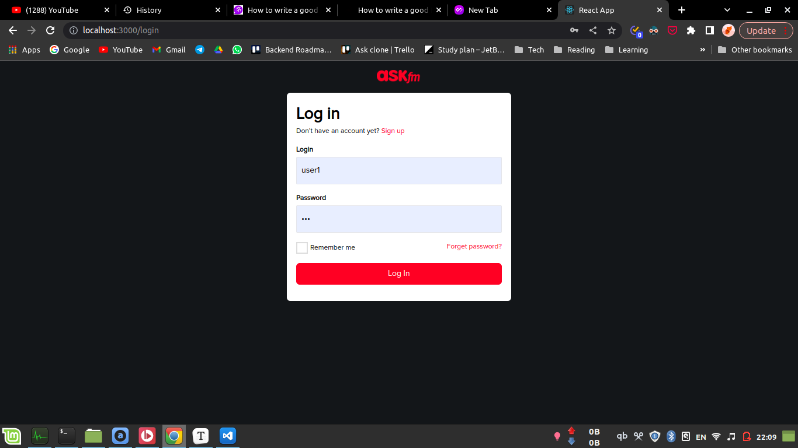
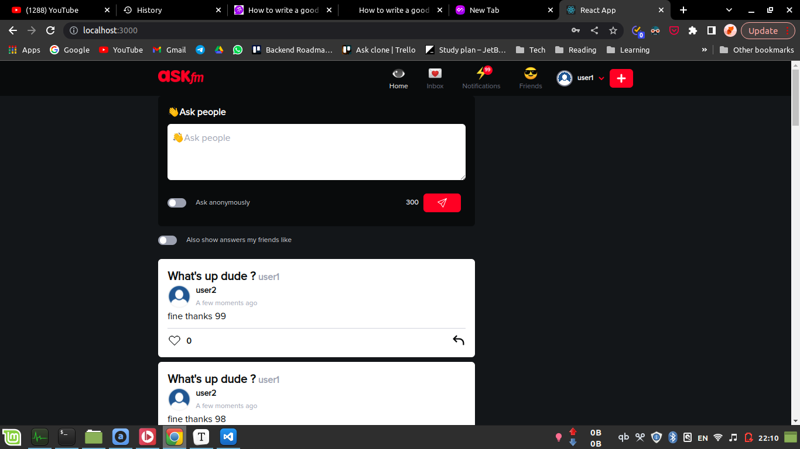
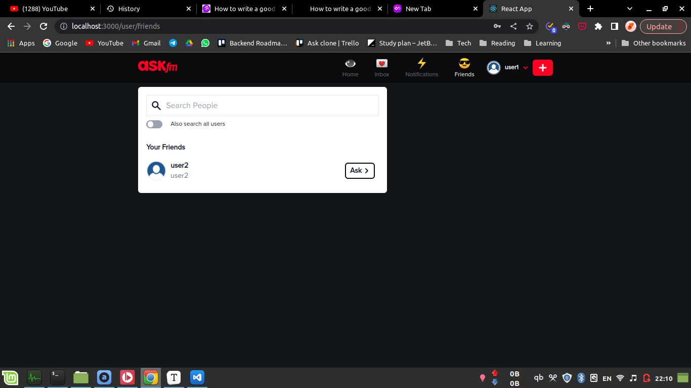
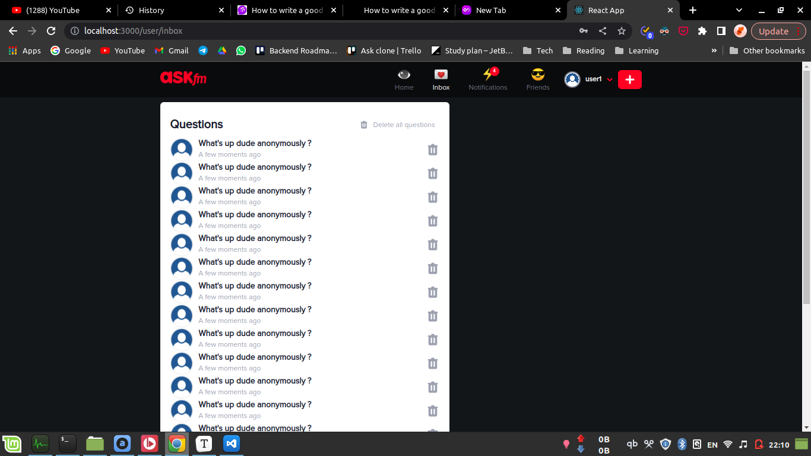
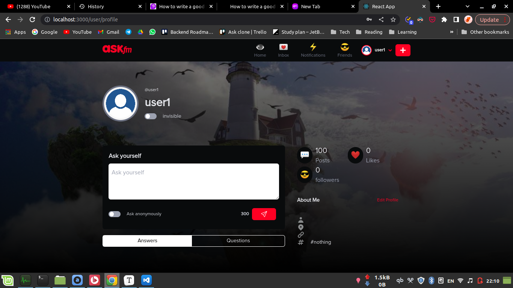
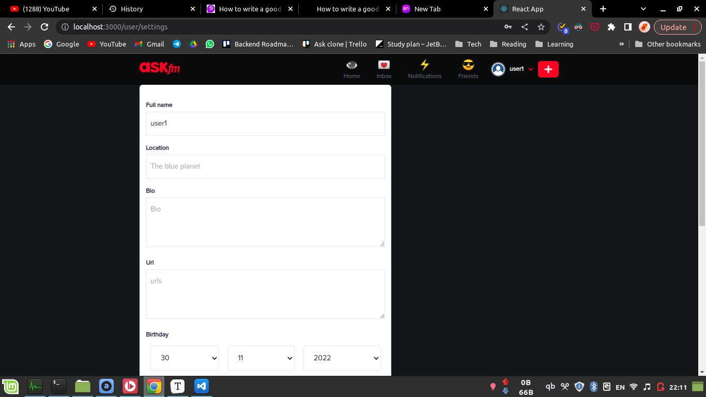

# ASK.fm Clone

a clone of basic features of [ask.fm](https://ask.fm/) built using react to build the frontend and java spring to build backend

### Table of Contents

- Technologies
- screenshots

## **Technologies**

### Frontend

- React
- tailwind
- redux
- yup

### Backend

- Spring boot
- Spring security
- hibernate
- mysql
- websockets
- lombok
- jwt

## Screenshots

### Sign up page

### Login Page

### Main Page

### Friends

### Inbox

### Profile

### Settings

